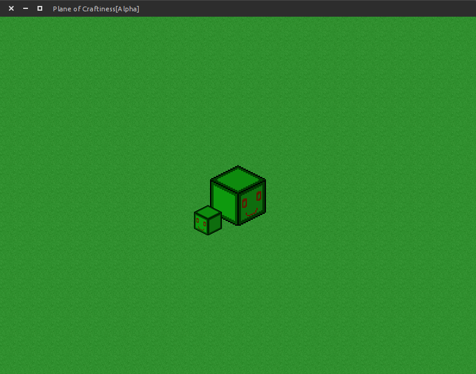

# Basic SDL2 Demo
This was my first coding project after learning the basics of C++.
It was originally inspired by [Plane of Goofiness](https://www.facebook.com/pages/Plane-of-Goofiness/30616386699).

## Dependencies
	SDL2
	SDL2_image
	SDL2_ttf

You can install these libraries on Ubuntu by typing:
> sudo apt-get install libsdl2-2.0-0 libsdl2-dev libsdl2-image-2.0-0 libsdl2-image-dev libsdl2-ttf-2.0-0 libsdl2-ttf-dev 

### Build and run the Game
In the project's top level directory:
>	./build.sh
>	./sdl2-demo

#### Created 2012 by Dan Hatch ####

